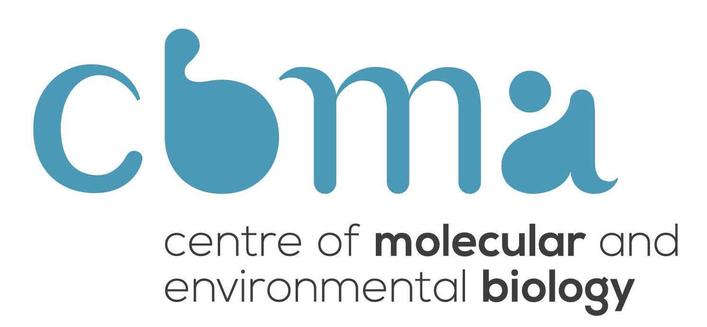

The Centre of Molecular and Environmental Biology (CBMA) is an FCT Research Unit, created in 2008 and hosted at the School of Sciences of UMinho.

Our mission is to deliver excellence in research and postgraduate training in Biological Sciences, while fostering scientific literacy and knowledge transfer.

The CBMA team consists of 48 researchers, 41 PhD students and 60 MSc students.

Here you will find mostly metadata for our publications, usually named according to in the format Lastname-year with the last name of the first author and the publication year.

